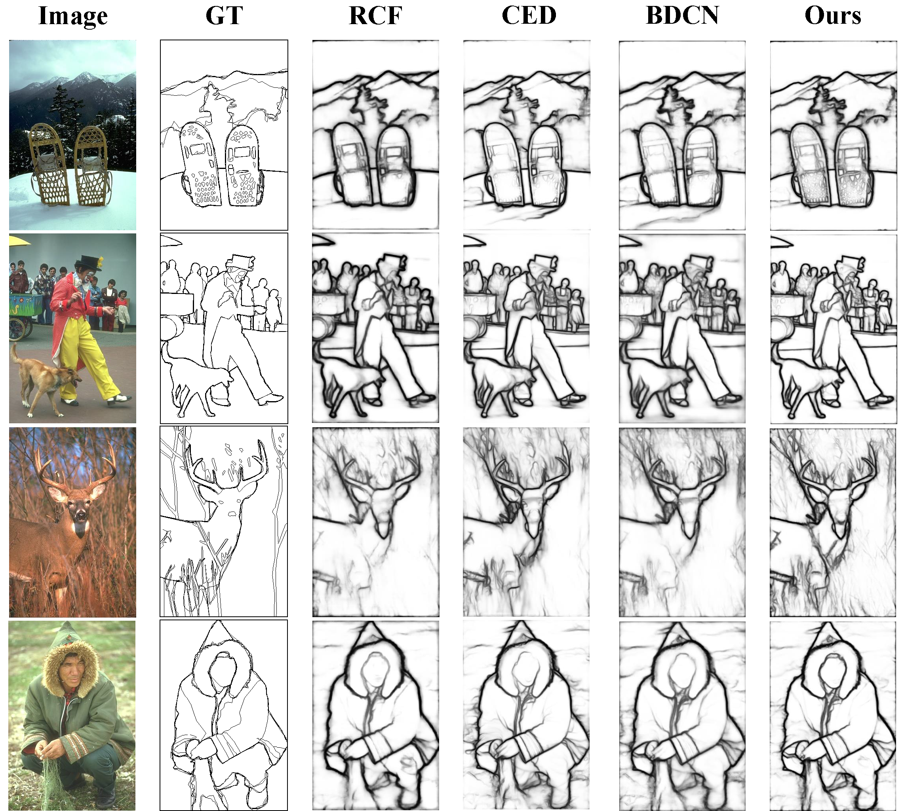
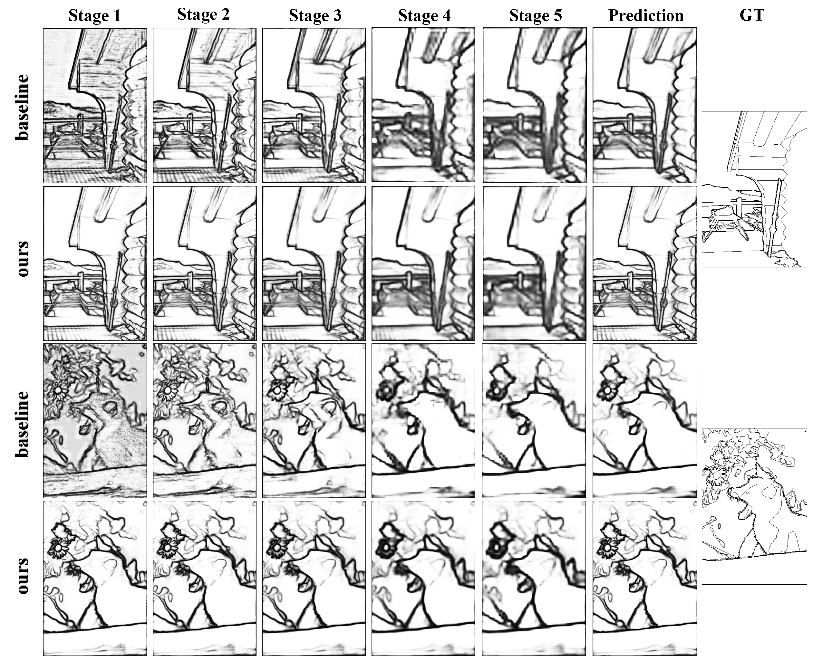

# FCL-Net

> This is a pytorch implementation of our FCL-Net, 2021, version 1.0.

## Performance

>  Here gives some examples of edge detection results, comparing with existing methods in Figure (a).  As shown in Figure (b), our method greatly improves fine-scale feature learning and detects more detailed edges with accurate location.

|                (a)                 |                   (b)                    |
| :--------------------------------: | :--------------------------------------: |
|  |  |

> We report ODS and OIS for comparison with other previous impressive works.

|   **Method**   |  **ODS**  |  **OIS**  |
| :------------: | :-------: | :-------: |
|     Human      |   0.803   |   0.803   |
|      SCG       |   0.739   |   0.758   |
|      PMI       |   0.741   |   0.769   |
|      OEF       |   0.746   |   0.770   |
|  DeepContour   |   0.757   |   0.776   |
|      HFL       |   0.767   |   0.788   |
|      *HED      |   0.790   |   0.805   |
|     CEDN+      |   0.788   |   0.804   |
|      COB       |   0.793   |   0.820   |
|      *RCF      |   0.797   |   0.811   |
|     *RCF+      |   0.807   |   0.823   |
|     *RCF++     |   0.813   |   0.829   |
|      CED       |   0.794   |   0.811   |
|     CED-MS     |   0.803   |   0.820   |
|     CED++      |   0.815   |   0.833   |
|  DeepBoundary  |   0.789   |   0.811   |
| DeepBoundary++ |   0.809   |   0.827   |
|      LPCB      |   0.800   |   0.806   |
|     LPCB+      |   0.808   |   0.824   |
|     LPCB++     |   0.815   |   0.834   |
|     *BDCN      |   0.807   |   0.821   |
|     *BDCN+     |   0.810   |   0.829   |
|    *BDCN++     |   0.819   |   0.837   |
|    RCF-SEM     |   0.799   |   0.815   |
|    RCF-SEM+    |   0.808   |   0.826   |
|   RCF-SEM++    |   0.814   |   0.833   |
|      BAN       | **0.810** | **0.827** |
|     BAN-MS     | **0.816** | **0.834** |
|   DexiNed-a    |   0.728   |   0.745   |
|   DexiNed-f    |   0.729   |   0.745   |
|      DSCD      |   0.802   |   0.817   |
|     DSCD+      | **0.813** | **0.836** |
|     DSCD++     |   0.822   | **0.859** |
|    **Ours**    |   0.807   |   0.822   |
|  **Ours-MS**   | **0.816** |   0.833   |
|   **Ours+**    | **0.813** |   0.832   |
|   **Ours++**   | **0.823** |   0.842   |


## How to Run our work

### Prerequisite

- Pytorch>=0.3.1
- Tensorboard
- AttrDict

### Train and Test the Network

1. **Prepare dataset**

   - to download current famous edge detection dataset, you can refer to https://github.com/MarkMoHR/Awesome-Edge-Detection-Papers to prepare data. PASCAL Context dataset is available [here](https://cs.stanford.edu/~roozbeh/pascal-context/), but needs to extract edges from segmentation masks. For convenience, [RCF](https://github.com/yun-liu/rcf) provides extracted annotations for NYUD and Pascal Context. 
   - data augmentation: [HED]( https://github.com/s9xie/hed)  and [BIPED]() have provide augmented dataset or code for augmentation.

2. **Download ImageNet pretrained parameters** 

   - download parameters provide by Pytorch [link](https://download.pytorch.org/models/vgg16_bn-6c64b313.pth) and put it into `./pytorch_net/models/`; 

3. **Training**

   - configure the parameters for training in `./pytorch_net/config`, we provide config files for our work; 

   - submit your task:

     ```shell
     HED_submit.sh
     ```

4. **Evaluation**

   - To evaluate the model, please refer to Testing HED part in https://github.com/s9xie/hed; 
   - Note that you need to use Piotr's Structured Forest matlab toolbox available here https://github.com/pdollar/edges, and remember to do NMS first if needed and put codes  in `./matlab_code`;
   - we provide an example here `./evaluation/eval_epoch_rcf_png.m` of Matlab.

5. **To draw P-R curves and compare with other works**

   - you can refer to https://github.com/yun-liu/plot-edge-pr-curves for details;


## Our Results

- We reveal the evaluation results after NMS of our method and our reproduced version of RCF, BDCN and baseline for comparison with other work in `\evaluation\eval`;

> Note that our reproduce version of BDCN employs the original code released by the authors here https://github.com/pkuCactus/BDCN; and we didn't reach the performance caused by subtle difference in data augmentation as referred to the author He.


## Reference

[1]. Our implementation is based on original project by [chongruo](https://github.com/chongruo/pytorch-HED);

[2]. When doing experiments, we also refer to wonderful projects of [liu](https://github.com/yun-liu/rcf) and [he](https://github.com/pkuCactus/BDCN); we also thank for their wonderful work and help;

